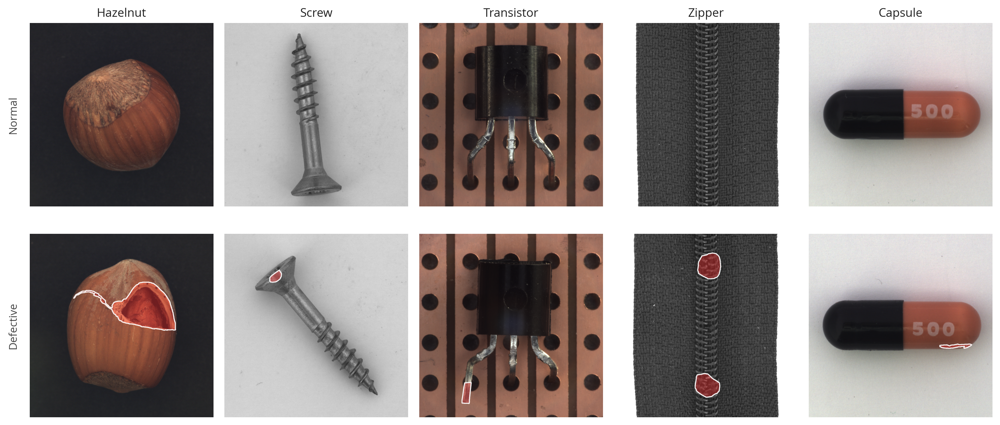
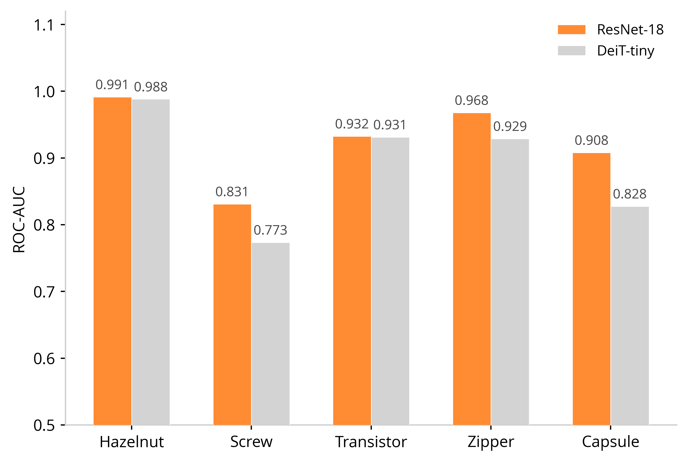
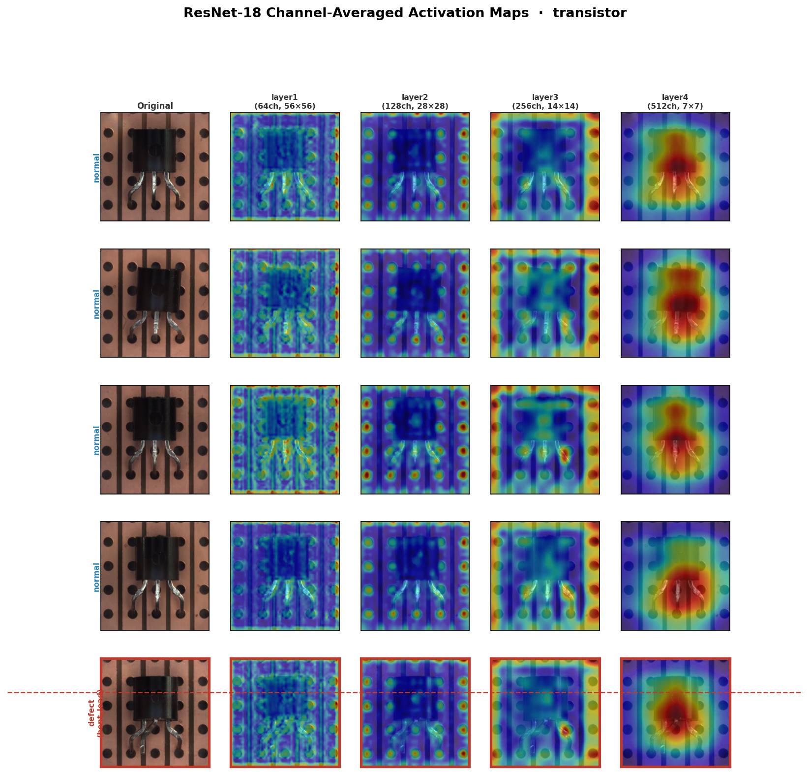
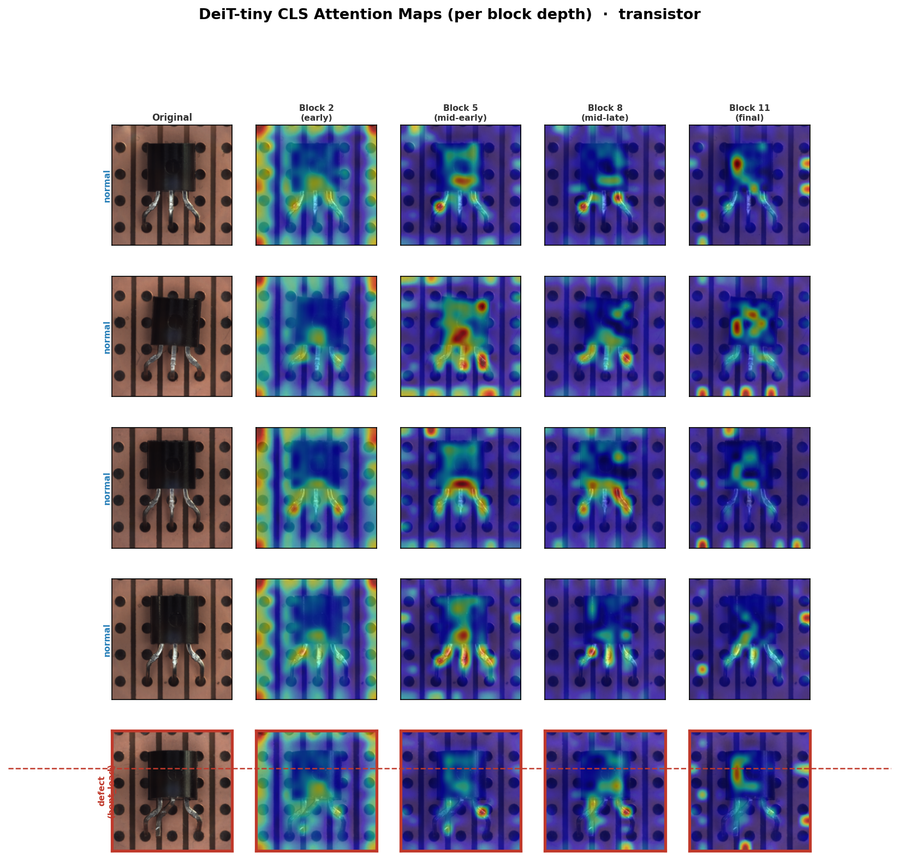
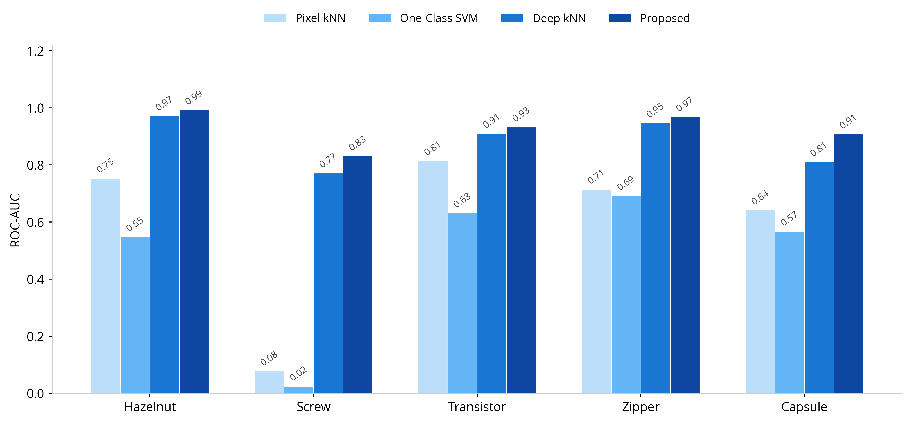

# Light-GCPF: Localized Anomaly Detection with Compact Pretrained Backbones

Localized industrial anomaly detection on the MVTec AD dataset using
pretrained ResNet-18 and DeiT-tiny as feature extractors, scored against
the distribution of normal patches with k-Nearest-Neighbour, Mahalanobis,
and KMeans density models.

This repository builds on the GCPF framework introduced by
Wan *et al.* (IEEE TIE 2022) and asks whether the same paradigm works
with backbones that are 5–6× smaller than the WRN-50 used in the
original work.



## Results

Across five MVTec AD categories (hazelnut, screw, transistor, zipper,
capsule), ResNet-18 Layer 3 reaches a mean image-level ROC-AUC of
**0.926** and DeiT-tiny Block 8 reaches **0.887**, both substantially
above pixel-space classical baselines (Pixel kNN 0.60, One-Class SVM
0.49).

### Per-category model comparison



### Qualitative localization

ResNet-18 layer-wise activations and patch-level anomaly map on a
bent-lead transistor:



DeiT-tiny block-wise activations on the same image:



### Classical baseline comparison



## Setup

```bash
python -m venv .venv
source .venv/bin/activate
pip install -r requirements.txt
```

Download the [MVTec AD dataset](https://www.mvtec.com/company/research/datasets/mvtec-ad)
and extract it so that each category sits under `data/`:

```
data/
  hazelnut/{train,test,ground_truth}/...
  screw/{train,test,ground_truth}/...
  ...
```

## Usage

End-to-end pipeline (extract features, score, save metrics):

```bash
python src/run_pipeline.py \
    --data_root data \
    --categories hazelnut screw transistor zipper capsule \
    --output_dir outputs
```

Generate analysis figures from `outputs/metrics/results_summary.csv`:

```bash
python src/layer_analysis.py
```

Run classical pixel-space baselines and produce the comparison figure:

```bash
python src/baseline_models.py
```

Generate the dataset sample figure:

```bash
python src/sample_viz.py
```

## Repository layout

```
src/
  dataset.py            MVTec DataFrame and PyTorch Dataset
  models.py             ResNet-18 and DeiT-tiny extractors with hooks
  extract_features.py   batched extraction with disk caching
  anomaly.py            kNN, Mahalanobis, KMeans detectors
  evaluate.py           ROC-AUC, PR-AUC, F1 metrics
  run_pipeline.py       end-to-end orchestrator
  layer_analysis.py     quantitative analysis figures
  baseline_models.py    classical baselines and comparison figure
  sample_viz.py         dataset sample figure
figures/                figures used in the README
requirements.txt
```

## Citation

If you use this code, please also cite the original GCPF paper:

```bibtex
@article{wan2022gcpf,
  author  = {Wan, Qian and Gao, Liang and Li, Xinyu and Wen, Long},
  title   = {Industrial Image Anomaly Localization Based on Gaussian
             Clustering of Pretrained Feature},
  journal = {IEEE Transactions on Industrial Electronics},
  volume  = {69},
  number  = {6},
  pages   = {6182--6192},
  year    = {2022},
}
```

The MVTec AD dataset is provided by MVTec Software GmbH:
[https://www.mvtec.com/company/research/datasets/mvtec-ad](https://www.mvtec.com/company/research/datasets/mvtec-ad)

## License

MIT. See `LICENSE`.
